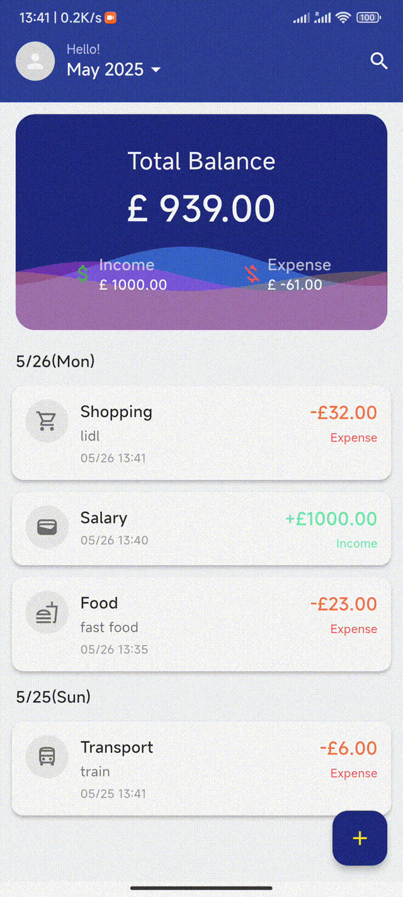
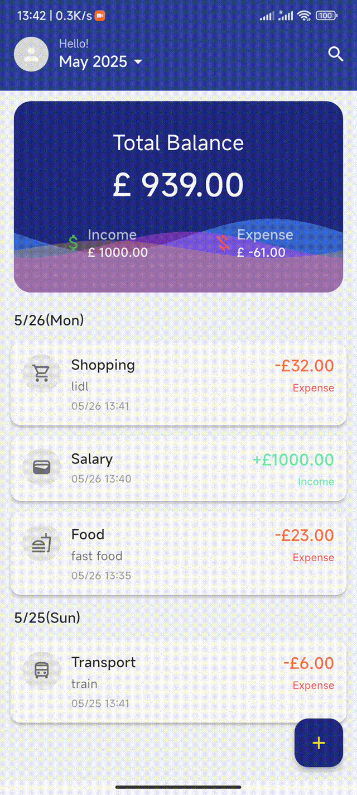

# 📒 Quick Accounting Tracker


<p align="center">
  
  
  
  
</p>


---


> 🧾 一款典雅简约、功能实用的 Flutter 记账助手应用。  
> 🎯 记录日常收入支出，管理分类，支持离线保存、国际化与夜间模式。

---

## ✨ 功能亮点

- 🧩 极简本地记账体验（SQLite 离线持久化）
- 📅 按月分页浏览账单，支持滑动加载
- 🔢 自定义键盘 + 分类图标 + 金额校验
- 🌙 支持暗黑模式切换
- 🌐 多语言支持（中文 & English）
- 🗃️ 分类管理：系统分类 + 自定义分类
- 🌊 动态波浪背景，典雅视觉风格
- 🛠️ 支持账单编辑 / 删除 / 查询
- 📝 版本更迭时间轴（Version Timeline）

---

## 🧭 截图预览（功能展示）

<span style='display:inline-block;width:32%;text-align:center'><b>1️⃣ 主页面</b></span><span style='display:inline-block;width:32%;text-align:center'><b>2️⃣ 添加账单</b></span><span style='display:inline-block;width:32%;text-align:center'><b>3️⃣ 删除账单</b></span>

<p float='left'>
  
  
  
</p>


<span style='display:inline-block;width:32%;text-align:center'><b>4️⃣ 跳转/搜索</b></span><span style='display:inline-block;width:32%;text-align:center'><b>5️⃣ 夜间模式</b></span><span style='display:inline-block;width:32%;text-align:center'><b>6️⃣ 多语言</b></span>

<p float='left'>
  
  
  
</p>


<span style='display:inline-block;width:32%;text-align:center'><b>7️⃣ 分类管理</b></span><span style='display:inline-block;width:32%;text-align:center'><b>8️⃣ 用户反馈</b></span><span style='display:inline-block;width:32%;text-align:center'><b>9️⃣ 版本回顾</b></span>

<p float='left'>
  
  
  
</p>

<span style='display:inline-block;width:32%;text-align:center'><b>🔟 清除缓存</b></span>

<p float='left'>
  
</p>


## 🗂️ 项目结构

```
lib/
├── data/            # 本地数据库访问（DAO、Entity、Migration）
│   ├── dao/         # DAO 层（如 UserDao、BillDao）
│   ├── db/          # AppDatabase 初始化与迁移
│   ├── dataModel/   # SQLite Entity 数据结构
│   └── repository/  # Repository 封装
├── models/          # UI 业务模型（如 Bill, Category）
├── screens/         # 页面视图（主页、设置页等）
├── widgets/         # 自定义组件
├── l10n/            # 多语言资源管理
├── theme/           # 夜间/日间主题
└── main.dart        # 项目入口
```

| 层级     | 模块          | 职责说明                           | 示例文件               |
| -------- | ------------- | ---------------------------------- | ---------------------- |
| 数据库   | `db/`         | 创建数据库与迁移                   | `app_database.dart`    |
| 数据模型 | `dataModel/`  | Entity 定义，映射数据库字段        | `user_entity.dart`     |
| DAO 层   | `dao/`        | 数据库操作封装（增删改查）         | `bill_dao.dart`        |
| 映射层   | `mapper/`     | 数据模型与业务模型转换             | `bill_mapper.dart`     |
| 仓储层   | `repository/` | 整合 DAO，封装业务逻辑调用入口     | `user_repository.dart` |
| 服务层   | `service/`    | 高级逻辑控制（如初始化、事务处理） | `bill_service.dart`    |
| UI 层    | `screens/` 等 | 页面与组件显示                     | `bill_home_page.dart`  |

---

## 📥 下载与体验

📦 [点击前往 Release 页面](https://github.com/Each9084/Quick_Accounting_Tracker/releases) 下载安卓 APK 文件安装体验。

---

## 🚀 快速开始

1. ✅ 安装 Flutter SDK，并配置 Android 开发环境
2. ✅ 克隆项目：

```bash
git clone https://github.com/Each9084/Quick_Accounting_Tracker.git
cd Quick_Accounting_Tracker
```

3. ✅ 获取依赖包：

```bash
flutter pub get
```

4. ✅ 启动项目：

```bash
flutter run
```

5. 打包项目(APK文件)

```dart
flutter build apk --release --no-tree-shake-icons
```

   `icons`存储在数据库中是动态,故而需声明

---

## 🌐 多语言与夜间模式

- 支持语言切换：
  - 🇨🇳 简体中文
  - 🇺🇸 English（默认）
- 在设置页面实时切换语言（无需重启）
- 支持亮 / 暗模式切换，可跟随系统设置

---

## 🧾 更新日志（Version Timeline）

> 📅 项目始于 2024 年 7 月 23 日，持续更新中  
> 🔖 当前版本：`v0.2.4`（2025-05-25）

📌 点击 App 侧边栏“版本更迭”可查看完整时间线。

---

## 📬 用户反馈与参与

欢迎通过以下方式反馈 Bug 或建议：

| 渠道           | 链接                                                         |
| -------------- | ------------------------------------------------------------ |
| 📮 GitHub Issue | [GitHub Issues](https://github.com/Each9084/Quick_Accounting_Tracker/issues) |
| 📧 邮件反馈     | [each9084@gmail.com](mailto:each9084@gmail.com)              |
| 📷 微信扫码     | 请在 App 内“反馈页面”扫码                                    |
| 📺 Bilibili     | [B 站主页](https://space.bilibili.com/34878493?spm_id_from=333.337.0.0) |

---

## 🚧 未来开发计划

- 🕐 OCR 小票识别备注（未实装）
- 🕐 Firebase 云同步（正在查看API文档）
- 🕐 多账本支持（已留下接口）
- 🕐 数据展示（正在寻找更好的插件）

---


---

## 🧩 插件说明

以下为本项目主要使用的 Flutter 插件：

| 插件名称                 | 版本     | 说明                                     |
| ------------------------ | -------- | ---------------------------------------- |
| `flutter_localization`   | ^0.3.0   | 官方国际化支持，用于语言切换             |
| `intl`                   | ^0.19.0  | 日期与本地化格式化处理                   |
| `sqflite`                | ^2.3.3+1 | 本地数据库 SQLite 实现                   |
| `path`                   | ^1.9.0   | 处理本地路径工具包                       |
| `path_provider`          | ^2.1.5   | 获取本地目录路径（如文档/缓存）          |
| `month_year_picker`      | ^0.4.0+1 | 支持年月选择器，用于快速跳转账单月份     |
| `provider`               | ^6.1.5   | 状态管理框架，简洁轻量                   |
| `url_launcher`           | ^6.3.1   | 跳转外部链接（如邮件、浏览器）           |
| `flutter_phoenix`        | ^1.1.1   | 实现 App 重启（如清除缓存后重启 App）    |
| `shared_preferences`     | ^2.3.3   | 简易本地键值对缓存，保存语言、主题等设置 |
| `cupertino_icons`        | ^1.0.6   | iOS 风格图标支持                         |
| `wave`                   | ^0.2.2   | 流动风格,UI美化工具                      |
| `flutter_launcher_icons` | ^0.14.3  | 自动生成图标工具                         |

> 💡 注：`wave` 插件未实际应用于当前页面绘制，自定义已实现类似效果,但未来可能作为视觉增强候选项。


## 💡潜在的问题

📦 package包名在 `android/app/build.gradle`下,由`namespace`和`applicationId`同时控制,如果你想构建自己的版本,请修改其中的字段为您的域名反转,建议将`namespace`和`applicationId`保持一致性,例如`com.zhangsan.accountbook`

同时`MainActivity`所在的`android/app/src/main/kotlin/com`的`com`文件夹也需保持一致

例如`android/app/src/main/kotlin/com/zhangsan/accountbook`,当然您可以将包名替换成任何您想替换的内容,具体细节请参考谷歌开发者文档,这里不再赘述.


🌍APP的多语言由安卓官方支持,如果你想更改APP的名称且随系统变化,可以在`android/app/src/main/AndroidManifest.xml`中找到`android:label="@string/app_name"`,

其中的英文字段在`android/app/src/main/res/values/styles.xml`

中文字段在`android/app/src/main/res/values-zh/strings.xml`

如果您想多语言可以在`res`下创建`values-xx/strings.xml`文件夹,在其中修改即好:

```xml
<resources>
    <string name="app_name">xxx</string>
</resources>
```


## 📄 License

本项目基于 MIT 协议开源，欢迎自由使用、Fork 与二次开发。